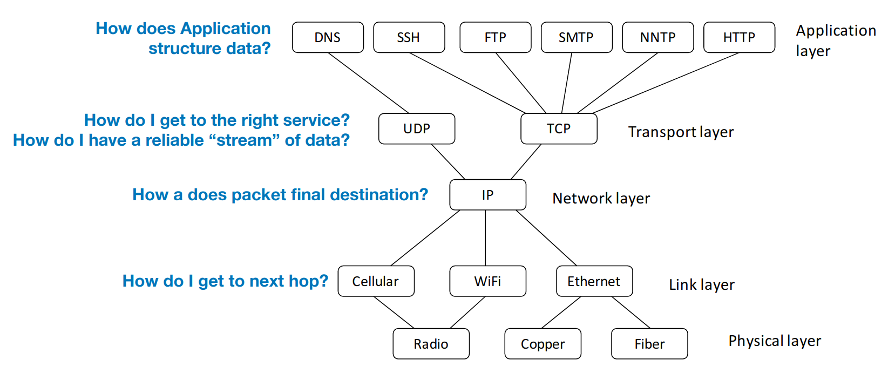

# Internet Protocol Security

## The Internet

* Global protocol that provides best-effort delivery of packet between connected hosts
* Packet: structured sequence of bytes
    - Header: metadata used by network
    - Payload: user data to be transported
* Every host has a unique identifier - IP address
* Series of routers receive packets, look at header destination address, and send it one hop towards destination IP address

## Network protocols

* Define how hosts communicate in published network protocols
    - Syntax: how communication is structured (e.g. format and order of messages)
    - Semantics: what communication means.
        - Actions taken on transmit or receipt of message, or when timer expiers.
        - What assumptions can be made.

## Protocol layering

* Networks use stack of protocol layers
    - Each layer has different responsibility
    - Layers define abstraction boundaries
* Lower layers provide services to layers above
    - Don't care what higher layers do
* Higher layers use services of layers below
    - Don't worry about how it works

### OSI 5 layer model

* Physical
    - How do bits get translated into electrical, optical, or radio signals.
* Link (typically: ethernet)
    - How to get packet to the next hop. Transmission of data frames between two nodes connected by a physical link.
    - Assumes: local nodes are physically connected
    - Task: transfer bytes between two hosts on physically connected network
    - MAC address: 6-byte address given to physical hosts, assigned at manufacture time
    - Frame contains:
        - Destination MAC
        - Source MAC
        - Data type (usually "IP")
        - Data
        - CRC checksum
    - Originally: transmission was broadcast, every local computer got every packet
    - Now: switched ethernet
        - Switch learns at which physical port each MAC address lives based on MAC source addresses
        - If switch knows MAC address M is at port P, it will only send a packet for M to port P
        - If not, sends packet everywhere
* Network
    - Repsonsible for packet forwarding. How to get a packet to the final destination when there are many hops along the way.
    - Assumes: frames can be sent on a local network
    - Task: let any two computers exchange packets
    - IPv4 header:
        - Instruct routers and hosts what to do with a packet
        - All values are filled in by the sending host
    - ARP: Address Resolution Protocol
        - How do we map IP addr -> MAC addr?
        - How do routes learn where IPs are located?
        
* Transport
    - Allows a client to establish a connection to specific services (e.g. web server on port 80): provides reliable communication
* Application
    - Defines how individual applications communicate. For example, HTTP defines how browsers send requests to web servers.

Interaction of layers:

### Packet encapsulation

* Protocol N1 can use the services of lower layer protocol N2
    - A packet P1 of N1 is encapsulated into a packet P2 of N2
    - The payload of P2 is P1
    - The control information of P2 is derived from that of P1