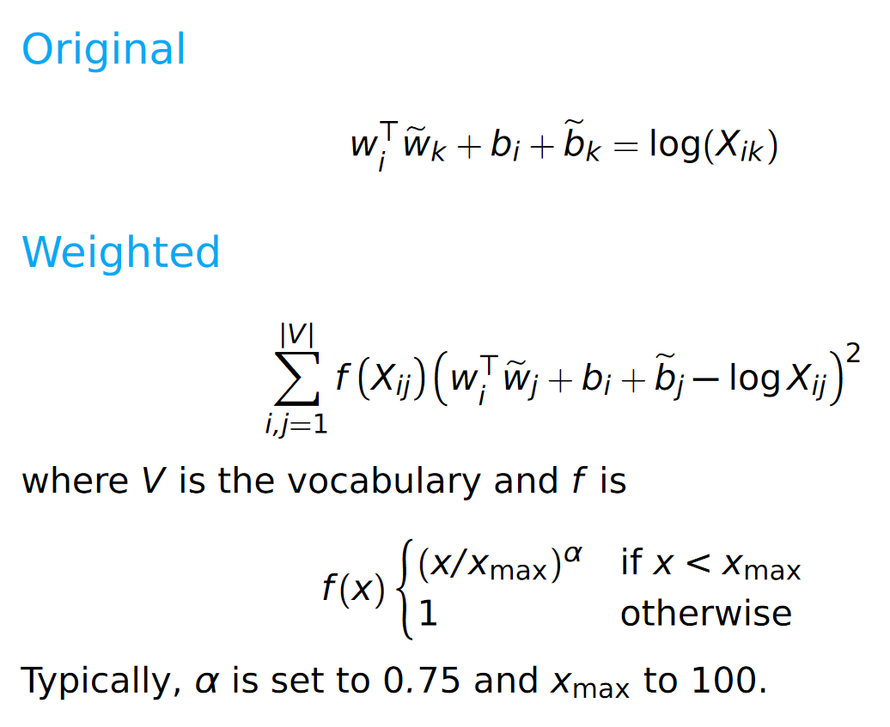

# Distributed word representations

## Meaning representations
Co-occurrence matrix:

Meaning can be present in such a matrix.
* If a word co-occurs often with "excellent," it likely is a positive word; if it co-occurs often with "terrible," it likely denotes something negative

## Guiding hypothesis for vector-space models
The meaning of a word is derived from its use in a language. If two words have similar vectors in a co-occurrence matrix, they tend to have similar meanings ([Turney and Pantel, 2010](https://arxiv.org/abs/1003.1141)).

## Feature representations of data
* *the movie was horrible* becomes [4, 0, 0.25] (4 words, 0 proper names, 0.25 concentration of negative words)
* Reduces noisy data to restricted feature set

## What do we define co-occurrence as?
For a sentence, e.g. *from swerve of shore to bend of bay, brings*

Consider the word "to"
* Window: how many words around "to" (in both directions) do we want to focus on?
* Scaling: how to weight words in the window?
    - Flat: treat everything equally
    - Inverse: word is weighted 1/n if it is distance n from the target word

Larger, flatter windows capture more semantic information, whereas smaller, more scaled windows capture more syntactic information

Can also consider different unit sizes - words, sentences, etc

## Constructing data
* Tokenization
* Annotation
* Tagging
* Parsing
* Feature selection

## Matrix design

### word x word
* Rows and columns represent individual words
* Value `a_ij` in a matrix represents how many times words `i` and `j` co-occur with each other in a given set of documents
* Very dense (lots of nonzero entries)! Density increases with more documents in the corpus
* Dimensionality remains fixed as we bring in new data as long as we pre-decide on vocabulary

### word x document
* Rows represent words; columns represent documents
* Value `a_ij` in a matrix represents how many times word `i` occurs in document `j`
* Very sparse: may be hard to compute certain operations, but easy storage

### word x discourse context
* Rows represent words; columns represent discourse context labels
    - Labels are assigned by human annotators based on what type of context the sentence is (i.e., acceptance dialogue, rejecting part of previous statement, phrase completion, etc)
* Value `a_ij` in a matrix represents how many times word `i` occurs in discource context `j`

### Other designs
* word x search proximity
* adj x modified noun
* word x dependency relations

Note: Models like GloVe and word2vec provide packaged solutions that pre-chose from these design choices. 

## Vector comparison (similarity)
Within the context of this example:

Note that B and C are close in distance (frequency info), but A and B have a similar bias (syntactic/semantic info)

### Euclidean

For vectors `u`, `v` of `n` dimensions:

This measures the straight-line distance between `u` and `v` capturing the pure distance aspect of similarity

Note: Length normalization

This captures the bias aspect of similarity

### Cosine
For vectors `u`, `v` of `n` dimensions:

* Division by the length effectively normalizes vectors
* Captures the bias aspect of similarity
* Not considered a proper distance metric because it fails the triangle inequality; however, the following does:

* But the correlation between these two metrics is nearly perfect, so in practice, use the simpler one

### Other metrics
* Matching
* Dice
* Jaccard
* KL (distance between probability distributions)
* Overlap

## Reweighting
Goal: Amplify important data useful for generalization, because raw counts/frequency are poor proxy for semantic information

### Normalization
* L2 norming (see above)
* Probability distribution: divide values by sum of all values

### Observed/Expected

**Intuition**: Keeps words in idioms co-occurring more than expected; other word pairs co-occur less than expected

### Pointwise Mutual Information (PMI)

%20=%20ln\left(\frac{X_{ij}}{\text{expected}(X,%20i,%20j)}\right)%20=%20ln\left(\frac{P(X_{ij})}{P(X_{i*})P(X_{*j})}\right))

This is the log of observed count divided by expected count.

### Positive PMI

PMI undefined when `X_{ij} = 0`. So:

%20=%20max(0,%20pmi(X,i,j)))

### TF-IDF

For a corpus of documents D:

## Dimensionality reduction

### Latent Semantic Analysis
* Also known as Trucated Singular Value Decomposition (Truncated SVD)
* Standard baseline, difficult to beat

Intuition:
* Fitting a linear model onto data encourages dimensionality reduction (since we can project data onto the model); this captures greatest source of variation in the data
* We can continue adding linear models to capture other sources of variation

Method:

Any matrix of real numbers can be written as

where `S` is a diagonal matrix of singular values and `T` and `D^T` are orthogonal. In NLP, `T` is the term matrix and `D^T` is the document matrix.

Dimensionality reduction comes from being selective about which singular values and terms to include (i.e., capturing only a few sources of variation in the data).

### Autoencoders
* Flexible class of deep learning architectures for learning reduced dimensional representations

Basic autoencoder model:

### GloVe
* Goal is to learn vectors for words such that their dot product is proportional to their log probability of co-occurrence

