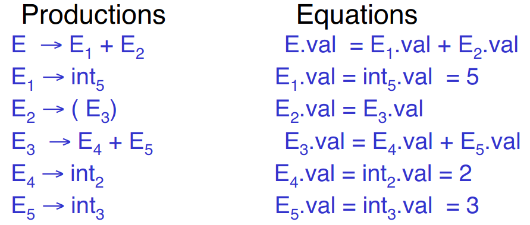

# Error handling

* Purpose of the compiler is to detect non-valid programs and to translate the valid ones
* Many kinds of possible errors:
    - Lexical (detected by lexer)
    - Syntax (detected by parser)
    - Semantic (detected by type checker)
    - Correctness (detected by tester/user)

## Syntax error handling

* Error handler should
    - Report errors accurately and clearly
    - Recover from an error quickly
    - Not slow down compilation of valid code
* Good error handling is not easy to achieve

## Panic Mode

* Simplest, most popular method of error detection
* When an error is detected:
    - Discard tokens until one with a clear role is found
    - Continue from there
    - These tokens are called *synchronizing* tokens
        - Usually statement or expression terminators
* e.g. expression `(1 + + 2) + 3`
    - Recovery involves skipping to the next integer after the second `+` and then continuing
* Bison: use special skip terminator `error` to describe how much input to skip
    - `E -> int | E + E | ( E ) | error int | ( error )`

## Error productions

* Idea: specify in grammar known common mistakes
    - Promotes common errors to alternative syntax to show more useful errors
* e.g. write `5 x` instead of `5 * x`
    - Add production `E -> ... | E E`
* Disadvantage: complicates grammar

## Local and global correction

* Idea: find correct "nearby" program
    - Try token insertions and deletions
    - Exhaustive search
* Disadvantages:
    - Hard to implement
    - Slows down parsing of correct programs
    - Nearby is not necessarily the "intended" program
    - Not all tools support it

## Past vs. present

* In the past, recompilation was slow (even once a day)
    - Wanted to find as many errors as possible in one cycle
    - Active area of research
* In the present, recompilation cycle is very quick (users tend to correct only a few errors per cycle)
    - Don't necessarily need complex error recovery, panic mode may be enough

# Abstract Syntax Trees

* So far: parser traces derivation of token sequences
* Rest of the compiler needs a structural representation of the program
* **Abstract syntax trees** (ASTs): like parse trees but ignore some details

For the following: consider the example

* Grammar: `E -> int | (E) | E + E`
* String: `5 + (2 + 3)`
* After lexing: `INT_5 PLUS LPAREN INT_2 PLUS 3 RPAREN`

## Parse tree vs. AST

Example parse tree:


* This does trace parser operation and capture nesting structure, but has a lot of additional details
    - Parenthesis
    - Single-successor nodes

Example AST:


* Captures what we want to, but much less unnecessary detail

## Semantic actions extension to CFGs

* Will use to construct ASTs
    - Can be used to build many other thing: type checking, code generation, computation, etc.
    - Process is called *syntax-directed translation*: substantial generalization over CFGs
* Each grammar symbol can have *attributes*
    - For terminals, attributes can be calculated by lexer
* Each production can have an *action*
    - Written as `X -> Y_1 ... Y_n { action }`
    - Can refer to or compute symbol attributes
* Specifies a system of equations
    - Declarative style: order of resolution is not specified and figured out by parser
    - Imperative style: order of resolution is fixed; important if actions modify global state
    - Bison has fixed order of evaluation for actions - values will depend on others
* Types of attributes:
    - Synthesized attributes: calculated from attributes of descendants in parse tree
        - e.g. `E.val`
        - Can be calculated in bottom-up order
        - Most common case: grammars with only synthesized attributes - called `S-attributed` grammars
    - Inherited attributes: calculated from attributes of parent and/or siblings in parse tree
* Example with above grammar:
    - For each symbol `X` define attribute `X.val`
        - For terminals, `val` is associated lexeme
        - For nonterminals, `val` is the expression's value (and is computed from values of subexpressions)
    - Annotate grammar with actions
        ```
        E ->  int       { E.val = int.val }
            | E1 + E2   { E.val = E1.val + E2.val }
            | (E1)      { E.val = E1.val }
        ```
    - For example string: processes into
        

## Dependency graphs

Example: 


* Attributes must be computed after all successors have been computed
* Orders exist only when there are no cycles

## Line calculator

* Each line contains an expression
    - `E -> int | E + E`
* Each line is terminated with the `=` sign
    - `L -> E = | + E =`
* Program is a sequence of lines
    - `P -> ε | P L`
* Attributes:
    - Each `E` has a synthesized attribute `val`, calculated as before
    - Each `L` has an attribute `val`
        ```
        L ->  E=   { L.val = E.val }
            | +E=  { L.val = E.val + L.prev }
        ```
    - Need value of previous line
        - Use inherited attribute `L.prev`
    - Each program `P` has synthesized attribute `val` equal to value of last line
        ```
        P ->  ε    { P.val = 0 }
            | P1L  { L.prev = P1.val; P.val = L.val }
        ``` 
        - Each `L` has inherited attribute `prev`
        - `L.prev` inherited from sibling `P1.val`

## Constructing an AST

* First: define AST data type
* Abstract tree type has two constructors in our example:
    - `mkleaf(n)` (creates leaf node)
    - `mkplus(T1, T2)` (creates `PLUS` node with two descendants `T1` and `T2`)
* Define synthesized attribute `ast`
    - Values of `ast` values are ASTs
    - Assume `int.lexval` is value of integer lexeme
    - Computed using semantic actions
        ```
        E ->  int          E.ast = mkleaf(int.lexval)
            | E1 + E2      E.ast = mkplus(E1.ast, E2.ast)
            | (E1)         E.ast = E1.ast
        ```
    - For our example:
        ```
        E.ast = mkplus(
            mkleaf(5),
            mkplus(
                mkleaf(2),
                mkleaf(3)
            )
        )
        ```