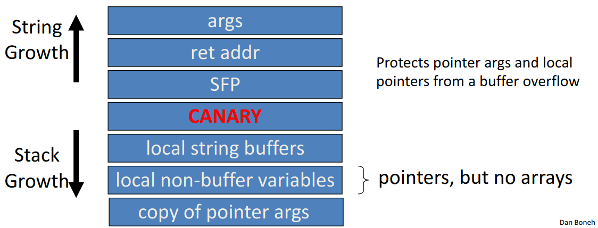

# Control Hijacking Defenses

Note: control hijacking attacks occur because data is mixed with control flow in memory -> allows attackers to mess with control flow by manipulating data

Ways to prevent control hijacking attacks:

1. Fix bugs
    - Audit software: automated tools include Coverity, Infer, etc.
    - Rewrite software in a type-safe language (Java, Go, Rust) - however this is difficult for existing/legacy code
2. Platform defenses: prevent attack code execution
3. Harden executable to detect control hijacking
    - Halt processes and report when exploit detected
    - e.g. StackGuard, ShadowStack, memory tagging, etc...

Idea: transform complete breach to denial of service

## Marking memory as non-execute (DEP)

* Prevent attack code execution by marking stack and heap as non-executable
* NX-bit on AMD64, XD-bit on Intel x86 (2005), XN-bit on ARM
    - disable execution: an attribute bit in every page table entry (PTE)
* Deployment: all major operating systems
    - Windows DEP: since XP SP2 (2004)
* Limitations:
    - Some apps need executable heap (e.g. JITs)
    - Can be easily bypassed using Return Oriented Programming (ROP)

### Attack: Return Oriented Programming (ROP)

* Control hijacking without injecting code
    1. Attacker overflows buffer
    2. Overflow string will set return address to the `exec` function in `libc.so`
    3. The argument will point to the string `/bin/sh` in `libc.so`
    4. When we exit this function, the `exec` function gets called and `/bin/sh` gets run
* Implementation details:
    - To run `/bin/sh` must redirect `stdin` and `stdout` socket:
        ```c
        dup2(s, 0);
        dup2(s, 1);
        execve("/bin/sh", 0, 0);
        ```
    - Look for *gadgets* in victim code (either in application, `libc.so`, or elsewhere) that match each of the above lines of code
        
    - Attacker just needs to look for segments containing gadgets in machine code (i.e. `pop rdi; ret` corresponds to `0x5fc3`)
        - Segments do not need to be instructions, they could just be a string or other data (as long as they are not located on the stack or heap)

### Defense: Address Space Layout Randomization (ASLR)

* On load: randomly shift base of code and data in process memory
    - Attacker does not know location of code gadgets
* Deployment:
    - `/DynamicBase` in Windows
    - Since Windows 8: 24-bits of randomness on 64-bit processors
    - Base of everything must be randomized or load:
        - Libraries (DLLs, shared libs), application code, stack, heap, etc

### Defense: kBouncer (2012)

* Observation: abnormal execution sequence: `ret` returns to an address that does not follow a `call`
* Idea: before a syscall, check that every prior `ret` is not abnormal
    - How: use Intel's Last Branch Recording (LBR)
        - Stores last 16 executed branches in a set of on-chip registers (MSR)
        - Read using `rdmsr` instruction from privileged mode
    - Before entering kernel, verify that last 16 `ret`s are normal
        - Requires no application code changes and minimal overhead
        - Limitations: attacker can ensure 16 calls prior to syscall are normal

## Hardening the executable

### Runtime checking: StackGuard

* Runtime tests for stack integrity
* Embed "canaries" in stack frames and verify their integrity prior to function returns
* Implemented as a GCC patch, minimal performance overhead (8% for Apache webserver)
* Random canary:
    - Random string chosen at program startup
    - Insert canary string into every stack frame
    - Verify canary before returning from function
        - Exit program if canary changed: turns potential exploit into DoS
    - To corrupt: attacker must learn/guess current random string
* Terminator canary: `canary = {0, '\n', '\r', EOF}`:
    - String fucntions will not copy beyond terminator
    - Attacker cannot use string functions to corrupt stack
        - Not used because this doesn't defend against stack-smashing using `memcpy`
* Enhancement: ProPolice
    - Since GCC 3.4.1 (`-fstack-protector`): rearrange stack layout to prevent ptr overflow
    
* MS Visual Studio `/GS` (`BufferSecurityCheck`)
    - Combination of ProPolice and random canary
    - If cookie mismatch, default behavior is to call `exit(3)`
    - Function prolog:
        ```assembly
        sub esp, 4 // allocate 4 bytes for cookie
        mov eax, DWORD PTR __security_cookie
        xor eax, esp // xor cookie with current esp - makes canary different across stack frames
        mov DWORD PTR [esp+4], eax // save in stack
        ```
    - Function epilog:
        ```assembly
        mov ecx, DWORD PTR [esp+4]
        xor ecx, esp
        call @__security_check_cookie@4
        add esp, 4
        ```
    - Protects all stack frames, unless can be proven unnecessary
* Note: canaries are not foolproof and do not prevent all control hijacking attacks
    - Some stack smashing attacks can leave canaries unchanged
    - Heap-based attacks still possible
    - Integer overflow attacks still possible
    - Even worse: canary extraction as a result of crash recovery
        - When process crashes, restart automatically (for availability)
        - Often canary is unchanged (reason: relaunch using fork)
        - Danger: can extract canary byte by byte
            - For each character in the canary, try to find the character to overflow with that does not make the program crash
        - Possible mitigation: watcher that doesn't use `fork`, or patching `fork` to change the canary (difficult research question, because `fork` copies the stack and need to go through and repatch the stack)
        - Note: similar technique can de-randomize ASLR

### More methods: Shadow Stack

* Keep a copy of the stack in memory
    - On `call`: push `ret`-address to shadow stack
    - On `ret`: check that top of shadow stack is equal to `ret`-address on stack; crash if not
    - Security: memory corruption should not corrupt shadow stack
* Using Intel CET (supported in Windows 10, 2020)
    - New register SSP: shadow stack pointer
    - Shadow stack pages marked by a new "shadow stack" attribute; only `call` or `ret` can read/write these pages
* ARM Memory Tagging Extension (MTE)
    - Idea: 
        - Every 64-bit memory pointer P has a 4-bit "tag" (in top byte)
        - Every 16-byte user memory region R has a 4-bit "tag"
    - Processor ensures that: if P is used to read R then tags are equal
        - Otherwise, hardware exception
    - Tags are created using new HW instructions
        - `ldg`, `stg`: load and store tag to a memory region (used by `malloc` and `free`)
        - `addg`, `subg`: pointer arithmetic on an address preserving tags
    - Tags prevent buffer overflows *and* use after free
        ``` c
        char *p = new char[40]; // p = 0xB000 6FFF FFF5 1240, *p tagged as B
        p[50] = 'a'; // B != 7 -> tag mismatch exception (buffer overflow), crash
        delete[] p; // memory is retagged from B to E
        p[7] = 'a'; // B != E -> tag mismatch exception (use after free), crash
        ```
        - Note: out of bounds access to `p[44]` at line 2 will not be caught

## Control Flow Integrity (CFI)

Ultimate goal: ensure control flows are as specified by code's flow graph

```c
void HandshakeHandler(Session *s, char *pkt) {
    // compile time: build list of possible call targets for s->hdlr
    // run time: before call, check that s->hdlr value is on list
    s->hdlr(s, pkt);
}
```