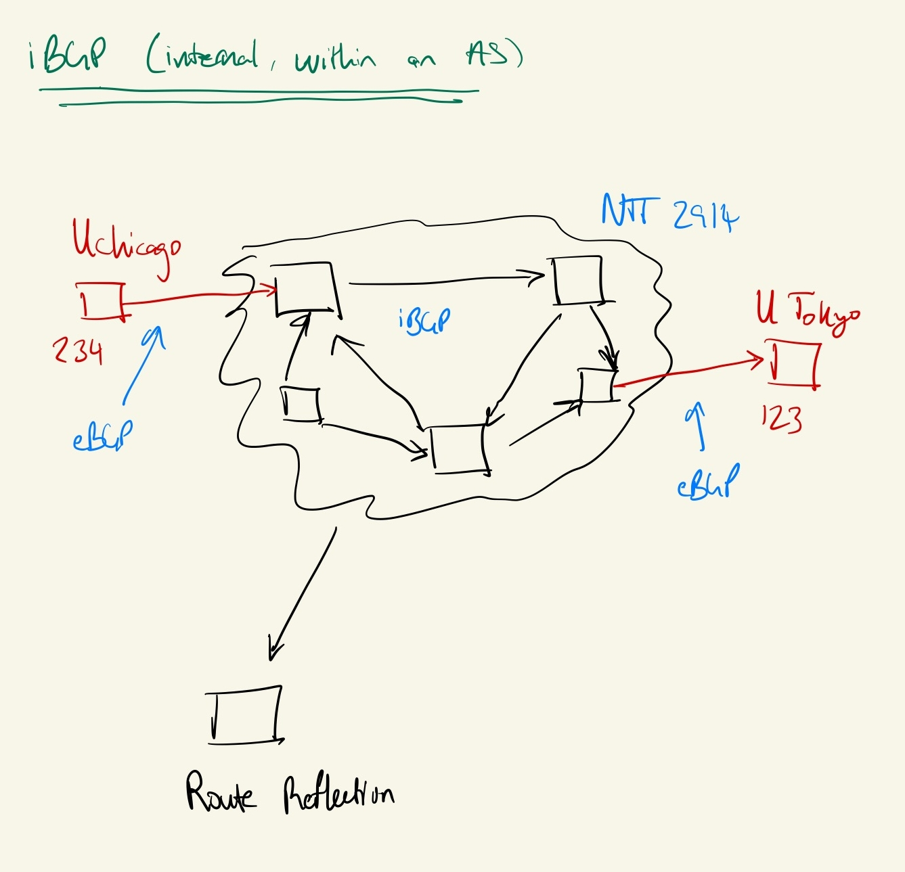

# The Modern Internet

## Revisiting BGP

### External BGP: between Autonomous Systems

### Internal BGP (iBGP): within an AS

* Set of private ASNs (192.168.0.0/16)
* eBGP: any route received over eBGP: propagate to both iBGP and eBGP peers
* iBGP: any route received over iBGP: propogate to only eBGP peers
* Instead of having a full mesh to take care of this: Route Reflection
    - Central server collects all the routes, decides which to propogate

### Types of routing

* Hot potato: get rid of the packet ASAP (used in practice, greedy)
    - Get it to the next AS that has the shortest path
        - Note: shortest path often means cheapest path
* Cold potato: hold onto packet as long as possible

### IP Transit and BGP Peering

* IP transit: entity pays an AS to gain access to the broader internet
    - Exchange: $$ for bits and BGP announcment
* BGP Peering (Peering relationship): no $$ exchanged, just bits run (b/c both sides get something out of the deal, e.g. two universities)
* Note: Every tier-1 provider peers with every other tier-1 provider
    - This provides full connectivity
    - But: anyone in this deal needs to be a *big* player to participate

* Suppose we're sending a packet from MIT to UChicago
    - Packet won't make it: NTT intermediary will only provide access to its own customers, not to others' customers
    - Would need Sprint and H.E. to be peers
* **This incentivises every Tier-1 to peer with each other**!

#### Choosing a transit providers

* Transit is a commodity!
* First question: where do you want to send traffic?
    - Choose a tier-1 more local to where the traffic needs to go
* Second question: Bandwidth
    - Committment: I will pay for 3Gbps every month, regardless of how much I use (less than that)
    - Burst: Amount of traffic above committment
        - e.g. 10 Gb Ethernet connection w/ 3Gb commit; amount extra used charged at higher burst rate
        - Charged at 95th percentile rule
            - Every 5 min, capture in/out rate of packets on the route
            - Line up measurements from min to max
            - Figure out where 95th percentile marker is, subtract commit, multiply by burst pricing rate (e.g. $0.10/Mb)
            - Sum of charges billed at EOM
        - Note: allowed to use as much bandwidth as needed for up to 72 min per 24 hours
            - e.g. avoids penalization for unseen amount of packets